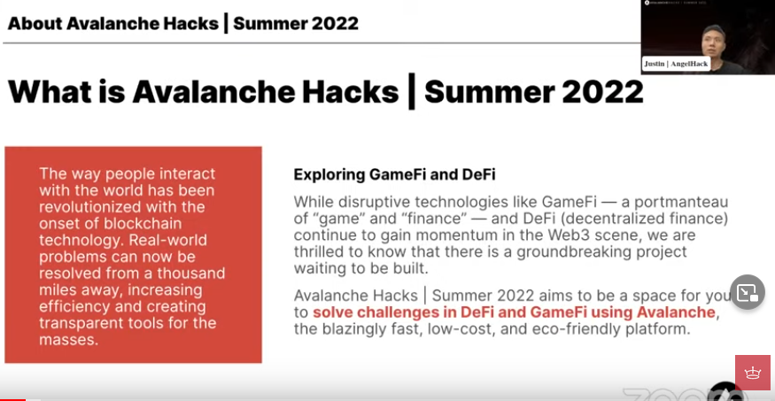
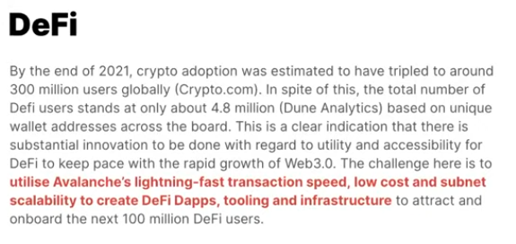
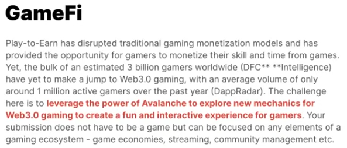
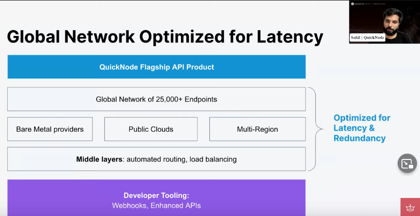
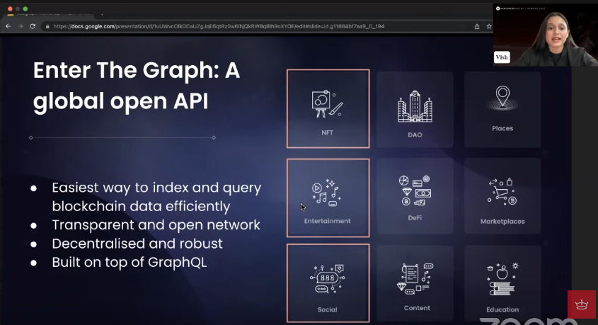
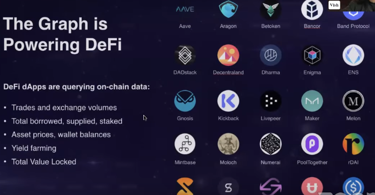
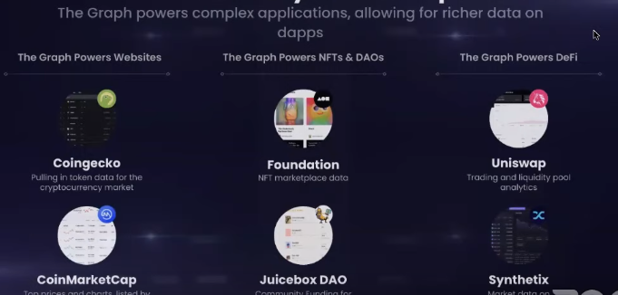
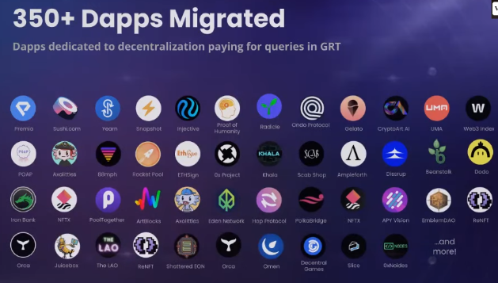
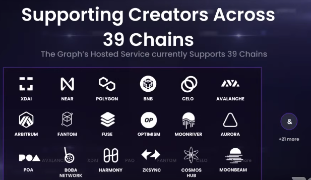
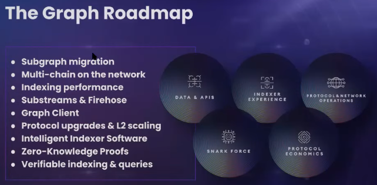

# Avalanche Hacks | Summer 2022

## Intro

Track 1 - DeFi

Track 2 - GameFi

## Workshop Day 1

https://youtu.be/4ToWMIaU7wM

### **How to create a dApp on Avalanche** 

Sahil Sen

Developer Evangelist, Quicknode

https://www.quicknode.com/guides/web3-sdks/how-to-create-a-dapp-on-avalanche-s-fuji-testnet-with-quicknode

- Global Network Optimized for Latency
  
- Resources:
  - quicknode.com/docs
  - quicknode.com/guides

### **Building decentralized GraphQL APIs for blockchain data!**

Vishwa Mehta from The Graph Foundation

Developer Relations Engineer

https://thegraph.com/blog/sunsetting-hosted-service

- The Graph = The decentralized indexing and querying protocol of Web3
- A global open API
  
- The Graph is powering DeFi
  
- Powered by The Graph
  
- 350+ Dapps migrated
  
- Supported blockchain frameworks
  
- Roadmap
  
- Get Involved
  - thegraph.com/docs
  - thegraph.com/discord

