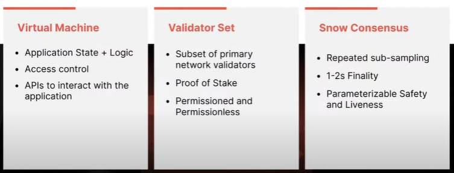

# Avalanche Hacks | Summer 2022

## Intro

Track 1 - DeFi

Track 2 - GameFi

## Workshop Day 1

https://youtu.be/4ToWMIaU7wM

### **How to create a dApp on Avalanche** 

Sahil Sen

Developer Evangelist, Quicknode

https://www.quicknode.com/guides/web3-sdks/how-to-create-a-dapp-on-avalanche-s-fuji-testnet-with-quicknode

- Global Network Optimized for Latency
  
- Resources:
  - quicknode.com/docs
  - quicknode.com/guides

### **Building decentralized GraphQL APIs for blockchain data!**

Vishwa Mehta from The Graph Foundation

Developer Relations Engineer

https://thegraph.com/blog/sunsetting-hosted-service

- The Graph = The decentralized indexing and querying protocol of Web3
- A global open API
  
- The Graph is powering DeFi
  
- Powered by The Graph
  
- 350+ Dapps migrated
  
- Supported blockchain frameworks
  
- Roadmap
  
- Get Involved
  - thegraph.com/docs
  - thegraph.com/discord

## Workshop Day 2

https://youtu.be/NSul9w2ziNY

Day 2 will feature workshops from the Ava Labs team! Join Gabriel as he conducts a workshop on AvalancheJS, followed by a workshop on Scaling Web3 with Subnets with Aaron! 

### Intro to AvalancheJS

Gabriel Cardona
Developer Evangelist, Avalanche

- Ava Labs Team
  

- C-suite
  

- The latest development from the past years in CS is amazing, there is no  best time to explore this field than now

- What is Avalanche? 

  - The Internet of Finance
  - network of networks, platform of platforms

- A Brief History of Blockchain (r)Evolution

  - Blockchain 1.0  - Bitcoin
    - Robust, Decentralized
    - Inflation leads to this development
    - since 2020, the hyperinflation will coming soon or later
    - the problem is energy consumption, but it will be solved in close future
    - stack-based programming language for bitcoin
    - gratitude for Satoshi Nakamoto
  - Blockchain 2.0 - Ethereum
    - Launch an application as a smart contract
    - Wave of innovation around tokens, smart contracts, initial coin offerings, oracles and decentralized finance and more
    - Vitalik Buterin
  - Blockchain 3.0 - Avalanche
    - Avalanche consensus, Network of Networks, Virtual Machines, Subnets

- Consensus - agreement on a decision

  - Perfect storm of features
    - Decentralized, Robust, High Throughput, Fast Finality, Lightweight, Quiescent, Performs well in adversarial conditions
  - Comparison
    

- Network of Networks - Compound Network Effects

  - Previous paradigm - single blockchain and validator set
  - New paradigm - heterogeneous network of blockchains and validator sets
  - Visualization
    

- Virtual Machines - Application Level Logic

  - Nearly arbitrary logic
  - Can use modern tooling
  - Don't have to worry about networking, consensus or state
  - Each VM launches on its own blockchain

- Subnets - Dynamic Validator Set

  - Manage their own membership
  - Spectrum of permissionless to permissioned networks
  - Compliance
  - Private blockchains
  - Separations of Concerns

- Primary Subnets - P, X, and C Chains
  

- AvalancheJS - The Avalanche Platform Javascript Library

  - based on TypeScript
  - support both browser and node.js, client and server
  - 3 areas of functionality: JSON RPC, transaction serializations, keychain
  - JSON RPC (Remote Procedure Calls)
    - API list: Admin, Auth, AVM (X-Chain), EVM (C-Chain), Health, Index, Info, Keystore, Metrics, PlatformVM (P-Chain), Socket
  - Transaction Serializations - State Machine Transitions
  - AVM - Avalanche VM
    - BaseTx, CreateAssetTx, OperationTx, ImportTx, ExportTx

  - Keychain - SECP256K1 Curve ECDSA Keypairs

### Scaling Web3 with Subnets - Experience Web3 Like Never Before

Aaron Buchwald
Software Engineer, Ava Labs

- Breakdown of a Blockchain
  

- Concensus Families
  

- Avalanche Subnets
  

- Orchestrating Subnets
  

- Subnet Effects
  

- What's Next? - New approaches and potential projects

  - Subnet Roadmap
    

  - Stateless Storage Today

    

- 

