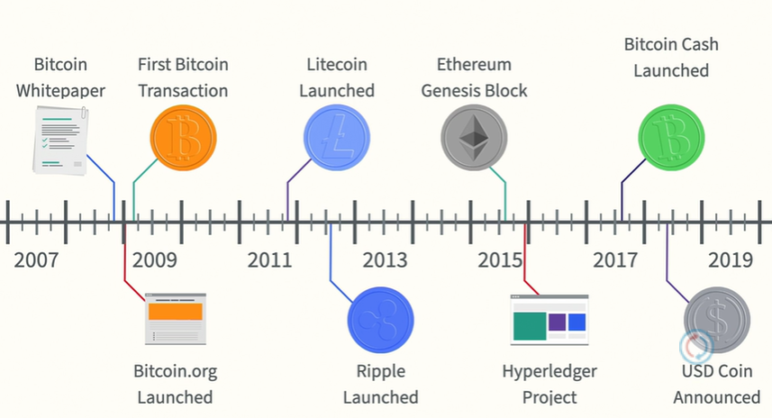
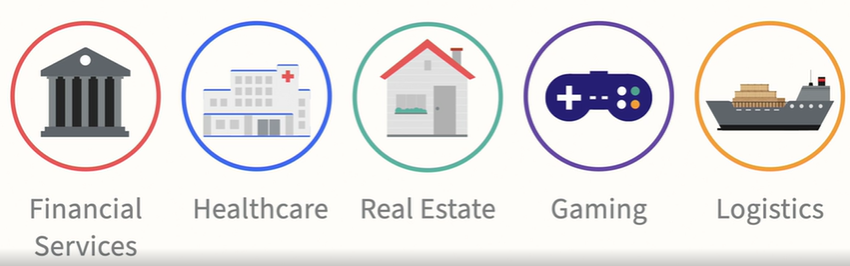
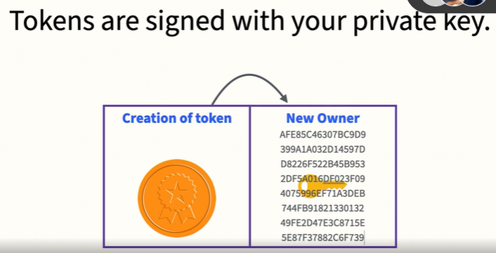

# LinkedIn Learning - Intro to NFT

https://www.linkedin.com/learning/introduction-to-nfts-non-fungible-tokens

Jonathan Reichental

Award-winning technology leader

## Non-Fungible Tokens

- How Bitcoin ultimately paved the way for NFTs
  - Starting from 2008 the birth year of BTC

- Blockchain provides:
  - authentication
  - validation
  - protection
- The architecture of NFTs: Ethereum, tokens, and smart contracts
  - EVM (Ethereum Virtual Machine)
    - Ether - crypto
    - Ethereum - network
    - Solidity - programming language
    - Smart contracts - apps (instructions)
    - Gas - purchased EVM time (service fee)
  - Distributed Apps (DApps)
    
  - Token
    A cryptocurrency that uses an existing smart contract-powered blockchain to give value to an exchange
    - Security Tokens
      Provide whole of fractional ownership of an asset
    - Utility Tokens
      Provide access to future products or services

## NFT Basics

- NFTs allow
  - Buying/Selling digital items
  - Verifying ownership of digital items
- How to buy and sell an NFT
  - Step 1: get a cryptocurrency wallet
    - most famous: MetaMask
  - Step 2: purchase some Ether
  - Step 3: select a platform
    - OpenSea, SuperRare
  - Step 4: buy or sell an NFT
- Sign process
  
- Challenges and risks of NFTs
  - Power Consumption
  - Proof of work
  - Copyright
  - Risk of blockchain failing
- The future of NFTs
  - Anyone can have a marketplace for their products
  - Enable new forms of royalties
  - Enable:
    - Storage - Accounting - Trading
  - Trends
    - Reduced counterfeiting
    - Licensing, certification
    - Financial innovation
      - DeFi
    - Collateral
    - Buying Digital Assets

