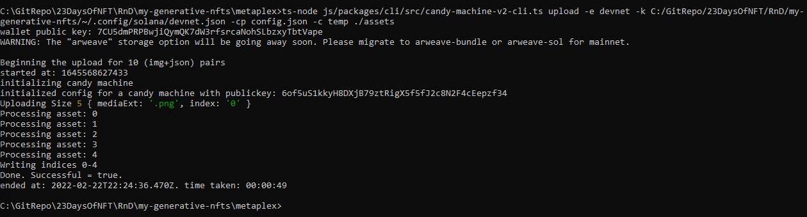
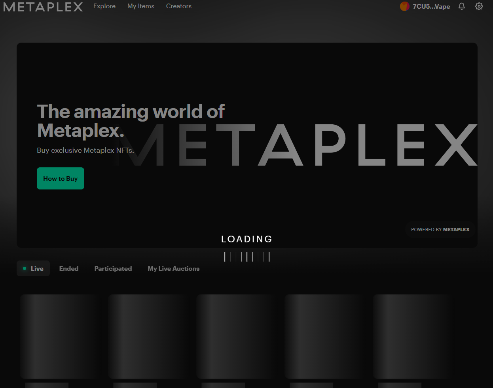

# General Info

https://learn.figment.io/tutorials/generative-nfts-on-solana-with-candy-machine-v2-and-hashlips

https://github.com/enliktjioe/23DaysOfNFT/tree/master/RnD/my-generative-nfts

## Uploading assets and Creating a Candy Machine

```
ts-node js/packages/cli/src/candy-machine-v2-cli.ts upload \
    -e devnet \
    -k C:/GitRepo/23DaysOfNFT/RnD/my-generative-nfts/~/.config/solana/devnet.json \
    -cp config.json \
    -c temp \
    ./assets
```

```
ts-node js/packages/cli/src/candy-machine-v2-cli.ts upload -e devnet -k C:/GitRepo/23DaysOfNFT/RnD/my-generative-nfts/~/.config/solana/devnet.json -cp config.json -c temp ./assets
```


Success Run:



## Example of working solution

https://circleanglenfts.web.app/


## Conclusion

Phantom Wallet connected but NFT marketplace site can't be refreshed
localhost:3000


