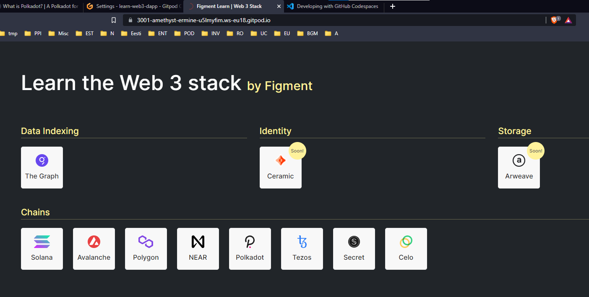
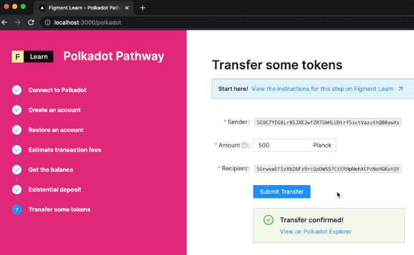

# References
- https://github.com/figment-networks/learn-web3-dapp

# Notes

- Using Gitpod for no setup / installation required in local machine
- Sign in Gitpod with Github account
- https://gitpod.io/#https://github.com/figment-networks/learn-web3-dapp 
- yarn (install yarn)
- yarn dev (deploy in dev mode)

