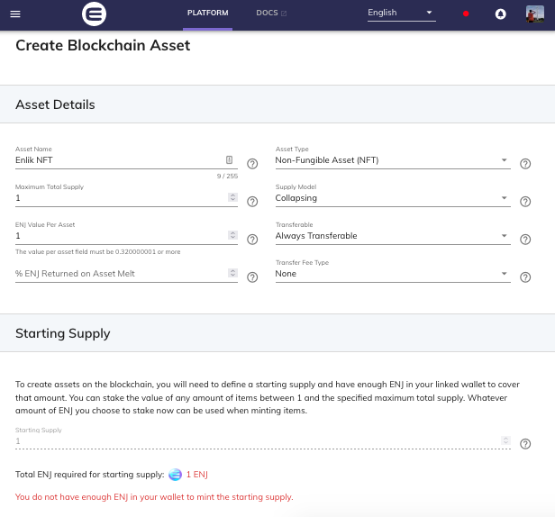
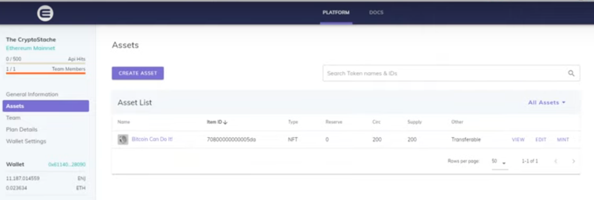
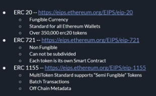
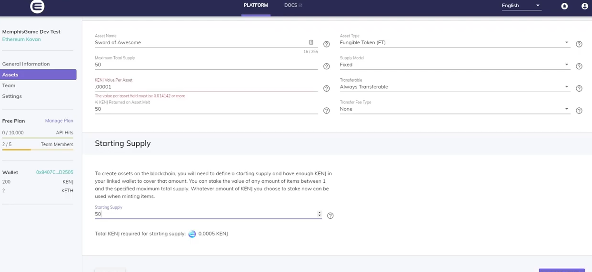

# References

- https://github.com/enjin/enjin-csharp-sdk
- https://enjin.io/help/creating-your-first-project
- [GDC 2019: Developing Ethereum Games with the Enjin Platform](https://youtu.be/cw24ySJoGYk)
- [How to Purchase Enjin Coin and Store in the Enjin Wallet to Manage NFTs (Non-Fungible Tokens)](https://www.youtube.com/watch?v=WZrbt5JUq8M)
- [Github - Enjin-Unity-Sample](https://github.com/twglhk/Enjin-Unity-sample)

## Testing

[Enjin Platform Mainnet Launch On Ethereum - Full Walkthrough Tutorial w/ Minting](https://www.youtube.com/watch?v=Tmd-oDObGas)

I can't setup because no money in my Enjit Wallet

From video:

[Memphis Game Developers - NFTs in Gaming With the Enjin Platform](https://www.youtube.com/watch?v=wZXwTk7dz7U)

Sample creating NFT asset

NFT Gaming

## Dev Test Wallet

fantasy apple fringe chapter
arrest bean soldier grain
badge equal injury wing 