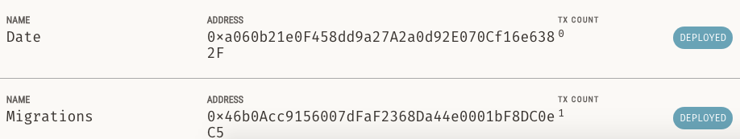

# NFT in 3 days

## References

- [Coding an NFT crypto collectible in 3 days](https://www.youtube.com/playlist?list=PLuZkwckxno0o7_GZoOBp2gnX5DfakVcxy)

## Notes

- Solidity is the programming language for blockchain

## Let's dig in

- Setup - Step by Step

  - Install Truffle `npm install -g truffle`
  - Init truffle project `truffle init` or `npx truffle init`
  - Install ganache
    - in macOS `brew install --cask ganache`

- Connect to Ganache
  

- My private ETH blockchain on my local machine
  

- Implement ERC721 and connect it to OpenSea

  - Install OpenZeppelin, a library for implementing different ERC tokens
    `npm install @openzeppelin/contracts`

  - Create sample file, Date.sol

  - Compile using `truffle compile`

    

  - Run `truffle migrate`

    

    

    

    - We need Date file into deployment file

  - Create `2_token_migration.js` file inside `/migrations` folder for 2nd deployment process
    

    

    

  - 

- 

